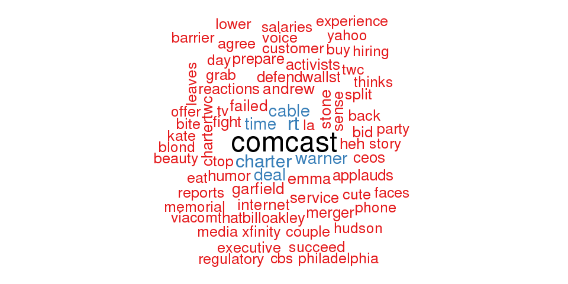
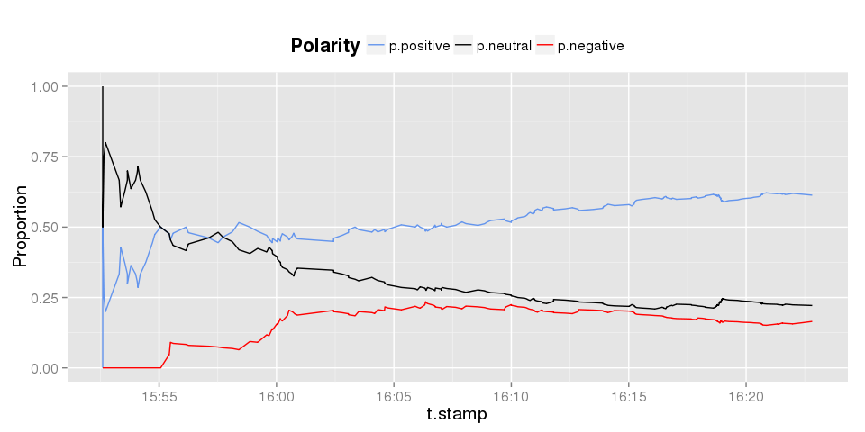
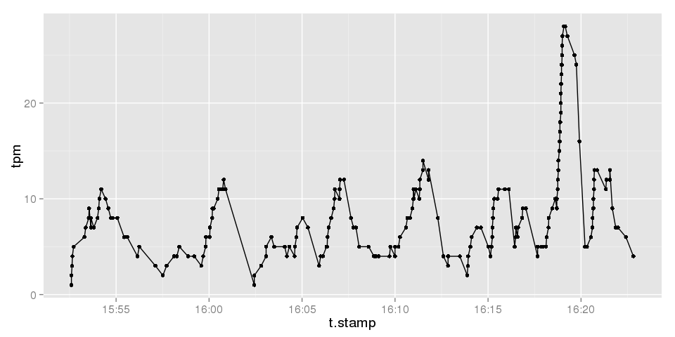

# twitteRStorm
Doug Raffle  
6/13/2015  


## Topics

- Streaming Data
- The Storm Framework
- Storm Topologies
- Prototyping with `RStorm`
- Case Study: Prototyping a Twitter Tracker
- Bridging the Gap: the `Storm` Package and the Multi-Language Protocol
- Bridging the Gap: Twitter Streaming APIs

## Streaming Data
What makes streaming data a special case?

- Information is constantly flowing
- Analysis/Models need to update as new information comes in
- Deliverables are (often) time sensitive
- Data piles up quickly -- Can't store everything


## Meet the Neighbors
Hadoop and Spark:

- Distributed
- Fault Tolerant
- Scalable
- Designed to analyze static data in batches
- Run batch once, get results

Spark has an answer for streaming data:

- Spark Streaming
- Works on "micro-batches" of data

## What is Storm?

Storm [@storm]:

- Distributed
- Fault Tolerant
- Scalable
- Designed for streaming data
- Runs constantly, updates results as new data comes in


## Who uses Storm?
Many companies you (probably) use every day [@usedby]:

- Twitter
- The Weather Channel
- Spotify
- Yahoo!
- WebMD

What do they all have in common?

- New information constantly coming in
- Users who want speed and accuracy

## The Storm Framework
What makes up a storm framework?

The **Topology** specifies:

- Where data comes from
- How we process each datum
- Where results are stored

Once a topology is running:

- New data enters the topology as it arrives
- The topology extracts relevant information
- Each datum is processed
- Applications or databases are updated

## Storm Topologies
Storm frameworks are specified by *topologies* consisting of spouts and bolts.

**Spouts:**

- Data sources, e.g., Twitter
- Every topology has at least one spout

**Bolts:**

- Process individual pieces of data
- Receive data from spouts or other bolts
- Send data to other bolts
- Store results in a database

## Storm: Data Structures
The basic data structure in Storm is a **tuple**.

- A key-value pair representing an observation (*a la* Hadoop/Spark)
- Spouts *emit* tuples as new data comes in
- Bolts *consume* tuples, process them, and emit 0 or more new tuples to other bolts

To aggregate results, bolts can also read from and write to more persistent data structures.

- Hash Maps -- quick, global storage, internal to topology
- Databases -- more persistent storage, accessible by outside applications

## The Topology Visualized


## Getting Storm Running
So how do we get Storm up-and-running?

- Storm is a complex framework with many dependencies
- Usually requires a data engineering team to implement at scale
- Even a local set up is time consuming and requires a fair amount of technical knowledge

Is there a Vagrant box?

- Wirbelsturm [@wirbel] - Germal for "cyclone"
- Comes pre-loaded, but not as user-friendly as Tessera boxes are for Hadoop/Spark
- No step-by-step tutorials

## Developing Topologies
Once Spark is installed, what language do we use to create topologies?

Spouts

- Written in a Java Virtual Machine (JVM) languages, e.g. Java, Clojure, Scala

Bolts

- Each one is a separate source file
- Can be written in any language using the Multi-Language Protocol
- Non-JVM languages (e.g. R, Python) must be wrapped in a JVM function

Topology

- Specified in YAML, packaged by Maven

## RStorm
Most statisticians and data scientists aren't fluent in JVM languages.  What do we do?

The `RStorm` package [@rstorm] is designed to *simulate* a Storm topology.

- `R` programmers can develop a topology in a familiar language
- Organizations can evaluate whether or not Storm is appropriate for their project

## RStorm
RStorm is:

- A simulation of Storm
- A first draft or scratch pad

RStorm is **not**:

- An equivalent of `Rhipe`/`RHadoop`/`SparkR`
- A way of communicating with Storm through `R`
- Used to write bolts that Storm can read (yet)

## `RStorm` Overview
`RStorm` works by simulating topologies with `R` functions and `data.frames`

- A spout is simulated by a `data.frame`, observations are emitted sequentially by row
- A tuple is a one row `data.frame`
- Bolts are functions which take a single tuple (`data.frame`) as input
- Storage is done exclusively in a hash map, where each record is a key-value pair of the form (`name`, `data.frame`)
- Hashes can be read/written from inside the topology
- "Trackers" can only be written to row-by-row from within the topology

## Top-Level `RStorm` Functions
These functions are used to specify the topology, run it, and get the results:

Function | Purpose
---------|------------
`Topology(spout, ...)` | Creates a topology from a `data.frame`
`Bolt(FUNC, listen = 0, ...)` | Creates a bolt from a function, `listen` specifies the source of tuples
`AddBolt(topology, bolt, ...)` | Adds a bolt to the topology
`RStorm(topology, ...)` | Runs a fully-specified topology
`GetHash(name, topology)` | Retrieves a hash from the finished topology
`GetTrack(name, topology)` | Retrieves a track from a completed topology

## Within-Bolt Functions
These functions are called within bolts to perform operations:

Function | Purpose
---------|--------------
`Tuple(x, ...)` | Generates a tuple from a one-row `data.frame`
`GetHash(name, ...)` | Retreives a hash from within the topology
`SetHash(name, data)` | Saves a `data.frame` to the hash with key `name`
`TrackRow(name, data)`| Row binds a one-row `data.frame` to a tracked `data.frame`
`Emit(x, ...)` | Emits a tuple from within a bolt

## Example: Summing Values
As a small example, consider the following:

- Observations coming in are numbers
- The final result is the sum of the numbers
- We want to track the sum over time

We will write a small sample topology to illustrate the ideas of `RStorm`

## Example Topology


## The Spout

```r
library(RStorm)
(dat <- data.frame(X = 1:5))
```

```
##   X
## 1 1
## 2 2
## 3 3
## 4 4
## 5 5
```

```r
topology <- Topology(dat)
```

```
## Created a topology with a spout containing  5 rows.
```

## Bolt 1: Current Sum

```r
get.sum <- function(tuple, ...){
  current.val <- tuple$X
  
  past.sum <- GetHash("current.sum")
  if(!is.data.frame(past.sum)) past.sum <- data.frame(c.sum = 0)
  
  current.sum <- past.sum$c.sum + current.val
  SetHash("current.sum", data.frame(c.sum = current.sum))
  Emit(Tuple(data.frame(c.sum = current.sum)), ...)
}
topology <- AddBolt(topology, Bolt(get.sum, listen = 0, boltID = 1))
```

```
## [1] "Added bolt get.sum to position 1 which listens to 0"
```

## Bolt 2: Track Sum

```r
track.sum <- function(tuple, ...){
  current.sum <- tuple$c.sum
  TrackRow("track.sum", data.frame(c.sum = current.sum))
}
topology <- AddBolt(topology, Bolt(track.sum, listen = 1, boltID = 2))
```

```
## [1] "Added bolt track.sum to position 2 which listens to 1"
```

```r
topology
```

```
## Topology with a spout containing 5 rows 
##  - Bolt ( 1 ): * get.sum * listens to 0 
##  - Bolt ( 2 ): * track.sum * listens to 1 
## No finalize function specified
```

## Get the Results

```r
results <- RStorm(topology)
GetHash("current.sum", results)
```

```
##   c.sum
## 1    15
```

```r
t(GetTrack("track.sum", results))
```

```
##       1 2 3  4  5
## c.sum 1 3 6 10 15
```

## Case Study: Twitter
You're a data scientist working for Comcast, and management wants to monitor tweets mentioning your company.  In particular, they want to know:

1. What are people talking about?
2. Are they saying positive or negative things?
3. What are the common topics of the good and bad tweets?
4. Can we track the percentage of good and bad tweets over time?
5. Can you tell us when people start talking about us more?
6. Can they have a dashboard for the marketing team to monitor, like [this](http://raffled.shinyapps.io/comcast_dash)?

## Twitter: Translating to Stats
First, we need to translate the requests to techniques and visualizations.

What are people talking about?

- Word frequencies $\to$ wordclouds

Are they saying positive or negative things?

- Classify the polarity (sentiment analysis)

What are common topics of good and bad tweets?

- Word frequencies by polarity $\to$ comparison clouds

## Twitter: Translating to Stats

Can we track the percentage of good and bad tweets over time?

- Track percent of each polarity classification over time $\to$ timeplots

Can you tell us when people start talking about us more?

- Track rate of tweets $\to$ timeplot

Can they get a dashboard?

- `shinydash`, Tableau, or Javascript

## Twitter: Which Platform?

**Small $n$, not time sensitive**

- Batch processing in `R` by day or week is probably good enough

**Small $n$, time sensitive**

- We can probably get away with an automated script and writing to a file/data base from within `R`

**Large $n$, not time sensitive**

- Hadoop or Spark batches run daily or weekly

**Large $n$, time sensitive**

- Storm (or Spark Streaming).  Assume this is the case.

## Prototyping the Stream
For our stream, we'll need:

- A `data.frame` of tweets for a spout

Bolts to:

- Track the rate of tweets using their time stamps
- Clean the text for sentiment analysis and word counts
- Count the words for the word cloud
- Classify the polarity
- Calculate the polarity over time
- Keep track of the words used in each polarity class

## Hashes
To store the tweets and track the information we need, we'll need hashes and trackers.

Hashes (read/write):

- Each tweet's time stamp
- Word Counts
- Polarity of each tweet
- Words associated with each polarity

Trackers (write row-by-row):

- Tweets per Minute (TPM) at each new tweet
- Polarity Percentages updated as tweets come in


## Implementing the Twitter Stream
Implementing the stream is the topic of the tutorial, for now we will:

- Describe the topology
- Describe the bolts needed
- Describe the hashes and trackers
- View the results

## Getting Tweets
Since `RStorm` needs a `data.frame` as input, how do we get tweets?

- `R` package `twitteR` can access Twitter's REST APIs [@rest] 
- Can search recent tweets by keyword, location, timeframe, etc.
- Only has access to a few days worth of tweets
- Tweets for this example were pulled May 27, right after Time Warner Cable and Charter announced their merger
- We will discuss the REST APIs in more detail during the tutorial


## The Bolts
Bolt | Purpose
-----|-------------
`track.rate()` | Calculate and track tweets per minute over time
`get.text()` | Extract text from tweet
`clean.text()` | Clean special characters, links, punctuation, etc.
`strip.stopwords()` | Clean conjunctions, prepositions, etc.
`get.word.counts()` | Create and update word counts
`get.polarity()` | Classify polarity of a tweet
`track.polarity()` | Track percentage of positive/negative/neutral tweets over time
`store.words.polarity()` | Store words for each polarity level

## Data Frames

`data.frame` | Role | Description
-------------|------|---------------
`comcast.df` | Spout | Table to simulate tweets 
`word.counts.df` | Hash | Stores word frequencies
`t.stamp.df` | Hash | Store unique time stamps
`tpm.df` | Tracker | Track tweets per minute over time
`prop.df` | Tracker | Track percentage per polarity over time
`polarity.df` | Hash | Store polarity per tweet
`polar.words.df` | Hash | Keep track of words associated with each polarity

## The Topology


## Running the Topology

```r
topo
```

```
## Topology with a spout containing 200 rows 
##  - Bolt ( 1 ): * track.rate * listens to 0 
##  - Bolt ( 2 ): * get.text * listens to 0 
##  - Bolt ( 3 ): * clean.text * listens to 2 
##  - Bolt ( 4 ): * strip.stopwords * listens to 3 
##  - Bolt ( 5 ): * get.word.counts * listens to 4 
##  - Bolt ( 6 ): * get.polarity * listens to 4 
##  - Bolt ( 7 ): * track.polarity * listens to 6 
##  - Bolt ( 8 ): * store.words.polarity * listens to 6 
## No finalize function specified
```

```r
result <- RStorm(topo)
```

## Analyzing the Results
To analyze the results we need to:

- Read `word.counts.df` and make a wordcloud
- Read `polar.words.df` and make a comparison cloud
- Read `tpm.df` and make a timeplot
- Read `prop.df` and make a timeplot

We will see the code for this in the tutorial, but for now we'll just look at the plots

## Wordcloud


## Comparison Cloud


## Polarity over Time


## Tweet Rate over Time


## Bridging the Gap
`RStorm` can't interface directly with Storm.  Instead, we use it to prototype streams.

What if we decide to implement our topology in Storm?

- Tuples are passed to non-JVM languages using Storm's Multi-Language Protocol (MLP)
- The MLP is just a JSON-like format for storing tuples
- Tuples are passed using standard input/output (*a la* Hadoop)

The `R` package `Storm` [@stormr]:

- Can read tuples in MLP from standard input
- Emits new tuples in MLP to standard output

## The MLP
Say we wanted to write a simple bolt which took a sentence and split it into individual words.  What would the sentence tuple look like in the MLP?

```
{
  "id": "-6955786537413359385",
  "comp": "1",
  "stream": "1",
  "task": 9,
  "tuple": [1, "snow white and the seven dwarfs"]
}
end
```

A `Storm` object in R will expect input of this format, and the package `Storm` includes basic utility functions for accessing information and processing bolts.

## `Storm` Bolt

```r
## bolt.R
## Load Storm Library
library(Storm)
## create the Storm object
storm <- Storm$new()
## create bolt function
storm$lambda <- function(s){
    tuple <- s$tuple
    words <- unlist(strsplit(as.character(tuple$input[2]), " "))
    sapply(words, function(word){
               tuple$output <- vector("character", 1)
               tuple$output[1] <- word
               s$emit(tuple)
           })
}
storm$run()
```

## Using a `Storm` Bolt
In Storm, a bolt written in a JVM language would call your `R` script containing the bolt code.  

Because Storm uses standard I/O for the MLP, you can simulate in a shell.
```shell
$ cat tuple.txt | Rscript bolt.R
{"command": "emit", "anchors": ["-6955786537413359385"], "tuple": "snow"}
end
{"command": "emit", "anchors": ["-6955786537413359385"], "tuple": "white"}
end
{"command": "emit", "anchors": ["-6955786537413359385"], "tuple": "and"}
end
{"command": "emit", "anchors": ["-6955786537413359385"], "tuple": "the"}
end
{"command": "emit", "anchors": ["-6955786537413359385"], "tuple": "seven"}
end
{"command": "emit", "anchors": ["-6955786537413359385"], "tuple": "dwarfs"}
end
```

## Bridging the Gap
For `RStorm`, we used the REST APIs to grab recent tweets.

In a live Storm environment, we'll need to process tweets as they come.

- Twitter's Streaming APIs [@streaming] offer an "always on" connection to Twitter
- We can filter and search by keyword, location, etc. just like with the REST APIs
- Storm can use Twitter as a spout using these APIs


## Tutorial
Source files on Github: 

[https://github.com/raffled/twitteRStorm/tree/master/tutorial](https://github.com/raffled/twitteRStorm/tree/master/tutorial)

Rendered HTML:

[stat.wvu.edu/~draffle/twitteRStorm_tutorial.html](http://stat.wvu.edu/~draffle/twitteRStorm_tutorial.html)


## References


